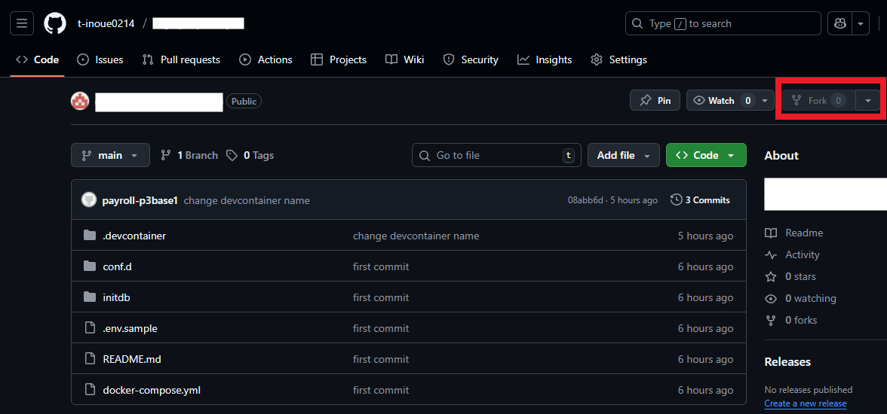
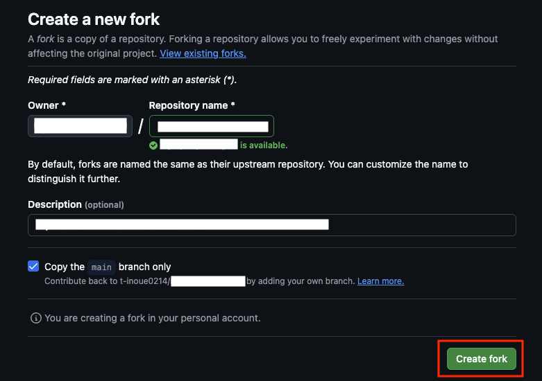
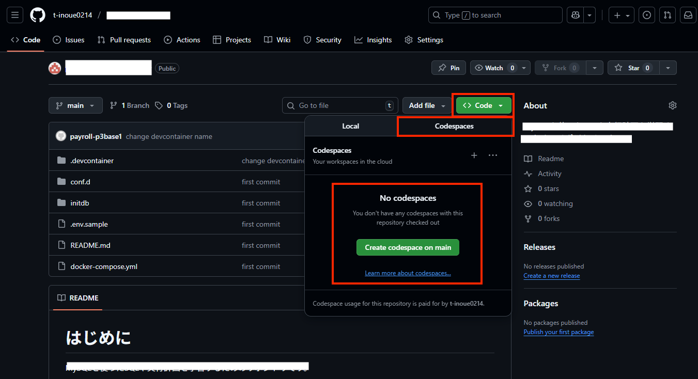
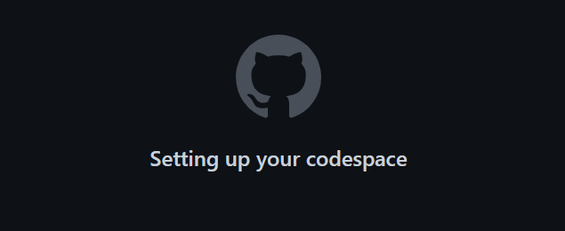
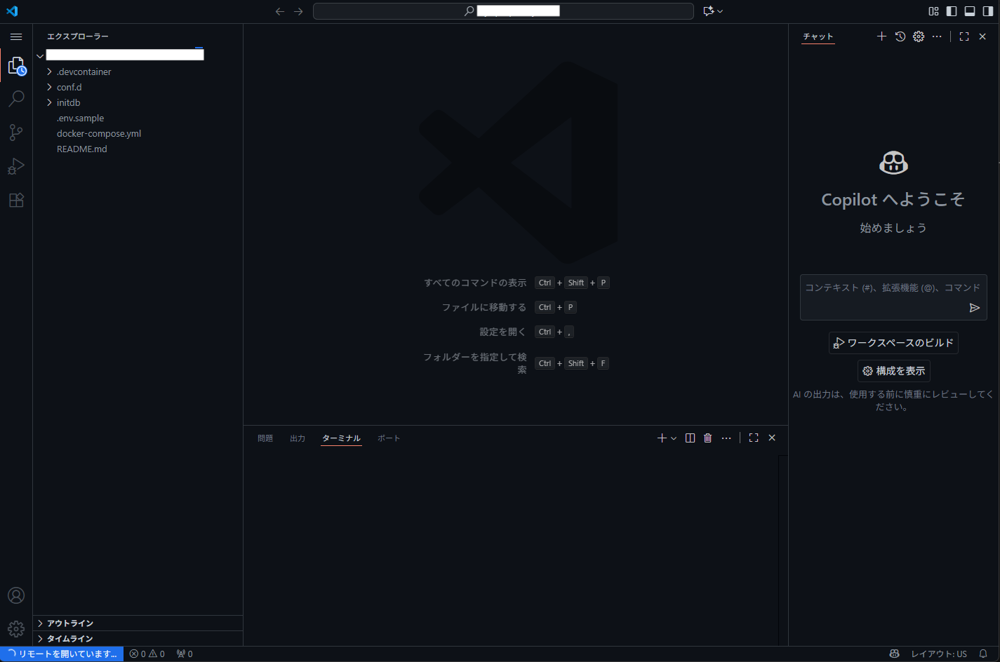
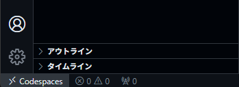

# starter-java-language-beginner

Javaの変数の定義と四則演算ができるようになったエンジニア向けの、ステップアップ用リポジトリです。

これまではプログラムを「上から下へ計算するだけ」でしたが、ここでは **「条件によって動きを変える」「大量のデータをまとめて扱う」「エラーに対処する」** といった、実際のアプリケーション開発で必須となるテクニックを学びます。

> **⚠️ 学習上の重要ルール**
> [Oracle公式ドキュメント(dev.java)](https://dev.java/learn/) の情報が「最新かつ正確」な一次情報です。
> ここで記載した内容や、もし AI から回答を得た場合であっても、**必ず [Oracle公式ドキュメント(dev.java)](https://dev.java/learn/) の記載を確認しながら実装する癖** をつけてください。

---

## 💻 開発環境 (Development Environment)

この勉強会では **GitHub Codespaces** を使用します。

面倒な環境構築は不要です。ブラウザさえあれば、すぐに学習を始められます。

1. **GitHubにログイン** してください（アカウントがない場合は作成してください）。

1. このリポジトリをフォークするため、右上の`fork`をクリックする（Forkの意味については [00. 歴史と概念](./00_history_and_concept/README.md#6-コラムforkフォークとは) で解説しています）

    

1. `Create fork`ボタンをクリックして、フォーク（自分のアカウントにコピーして新しいリポジトリを作成）します。

    

1. `Codespace`を起動するため、`Code`タブに移動し、右上にある緑色の`code`のプルダウンメニューを開き、`Codespace`タブを開き、`Create codespace on main`をクリックします。

    

1. `Codespace`の生成にはしばらく時間がかかるため、しばらく待ちます。

    

1. `VSCode`が起動しますが、画面左下が`リモートを開いています...`の間は待ちます。

    

1. 画面左下が`Codespace`になった場合は、`Codespace`が起動完了しました

    

環境が立ち上がったら、左側のファイル一覧から学習したい章のフォルダを開いてください。

## Codespaces利用上の注意

- `Github`の`Codespaces`を利用します。`Codespaces`は設定によってはコストがかかるものなので [Codespace の利用上の注意](./CODE_SPACES_SERICE.md) はよく確認してください。
- コストをかけないためにも、セキュリティの意味でも、使い終わったら [停止方法](./CODE_SPACES_SERICE.md#3-停止方法) に従って停止することを推奨します。
ます。 |

---

## 🚀 2. 学習の始め方

1. Codespaces を起動
    - 

1. **環境の準備を待つ**
   - ブラウザでVS Codeが起動します。
   - 初回はJavaのセットアップや日本語化のために1〜2分ほどかかります。
   - 左下のステータスバーなどが落ち着くまで少し待ちましょう。

1. **学習スタート！**
   - 左側のファイル一覧から [`basics_controlのREADME`](./src/main/java/com/example/basics_control/README.md) を開きます。
   - `README.md` をクリックして開き、解説を読みながら進めてください。
   - `README.md` を右クリックして「プレビューを開く (Open Preview)」を選ぶと読みやすくなります。

---

## 📚 学習カリキュラム

`src/main/java/com/example/` 配下のパッケージが、そのまま学習の章立てになっています。
順番に進めていくことで、無理なく知識を積み上げられます。

| 章 | パッケージ名 | テーマ | 学習内容 |
| :--- | :--- | :--- | :--- |
| **1** | [`basics_control`](./src/main/java/com/example/basics_control/README.md) | **制御構文とメソッド** | 分岐(`if`/`switch`)、反復(`for`/`while`)、メソッドの定義方法を学びます。 |
| **2** | [`reference_types`](./src/main/java/com/example/reference_types/README.md) | **参照型とメモリ** | プリミティブ型との違い、スタックとヒープ、参照渡しの副作用について実験します。 |
| **3** | [`collections_basic`](./src/main/java/com/example/collections_basic/README.md) | **コレクション基礎** | 固定長の「配列」の不便さを知り、可変長の `List` と検索用の `Map` を習得します。 |
| **4** | [`exceptions_handling`](./src/main/java/com/example/basics_control/README.md) | **例外処理** | `try-catch` によるエラーハンドリングと、スタックトレース（エラーログ）の読み方を学びます。 |
| **5** | [`collections_advanced`](./src/main/java/com/example/collections_advanced/README.md) | **コレクション応用** | `HashMap`の種類の使い分け、ソート(`Comparator`)、シャローコピーの罠など、実務的なトピックです。 |
| **6** | [`modern_logic`](./src/main/java/com/example/modern_logic/README.md) | **モダンJava入門** | `Stream API` や `Optional` を使い、現代的なJavaの書き方（脱・初心者）に触れ |

---

## 💻 4. 開発環境について

この講座は以下の環境で動作するように設定されています（自動構築されます）。

- **OS:** Linux (Debian)
- **Java:** OpenJDK 21
- **Editor:** VS Code Web (日本語化済み)
- **Extensions:**
  - Extension Pack for Java
  - Japanese Language Pack

---

## 📝 重視する思想

このリポジトリでは、「実際に手を動かしてみる」ことを何より重視しています。

エンジニアの技術は、資料を読むだけで覚えたり、理解したりすることは難しいものです。

例えば、自動車教習所の教本を完璧に暗記したとしても、それだけで実際に車を運転できるようにはなりませんよね？

ハンドルを握り、アクセルを踏むという「実体験」がなければ、運転技術は身につきません。

ソフトウェア技術も同じです。

技術的な仕組みを知ることも大切ですが、実際に実行した経験こそが現場で役立ちます。

読むだけで終わらせず、ぜひご自身の手で実行してみてください。
